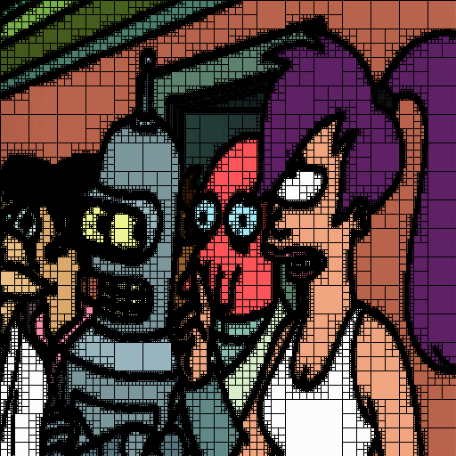
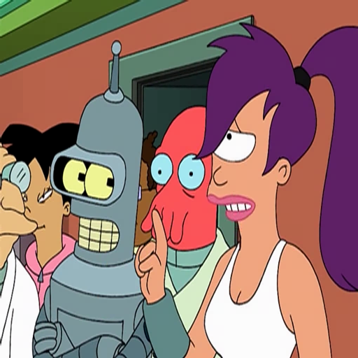
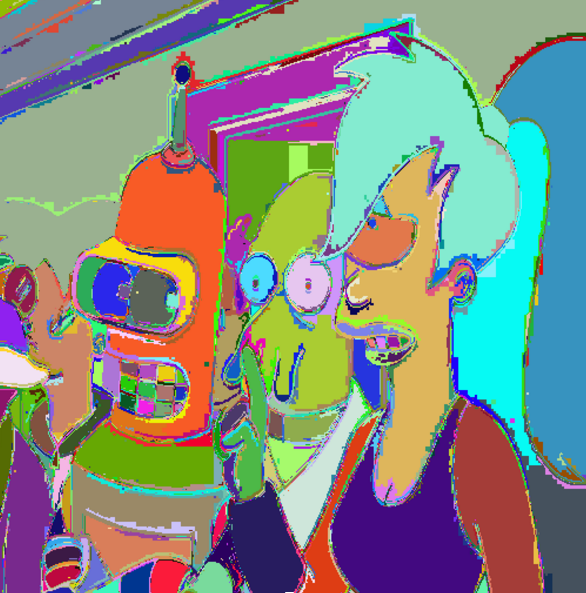
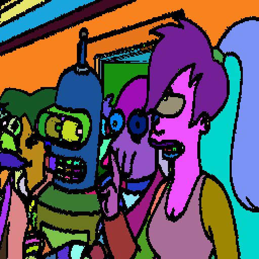
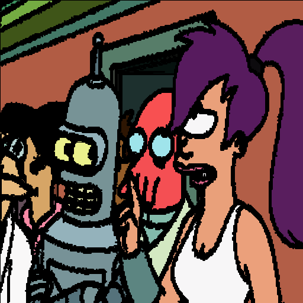
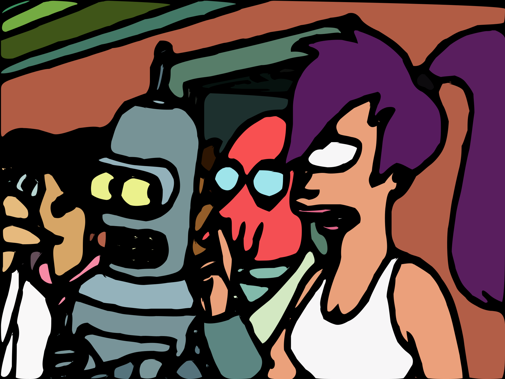
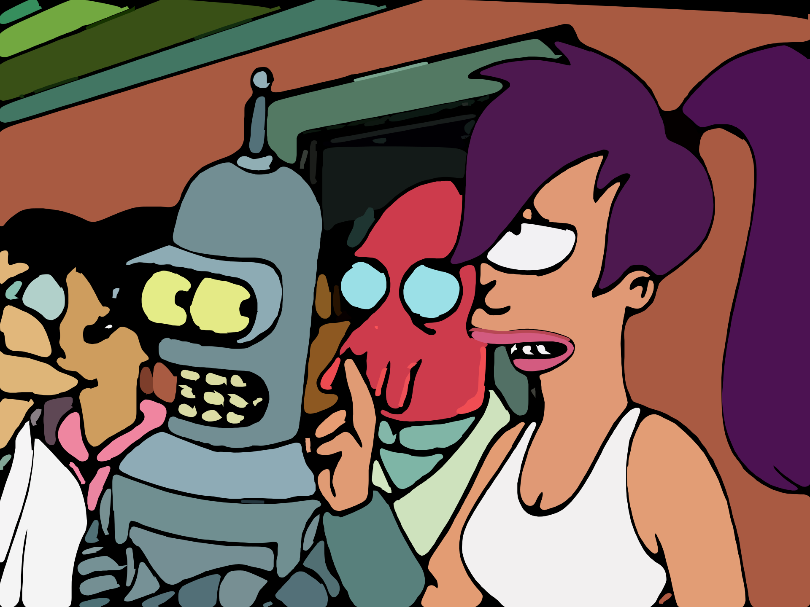
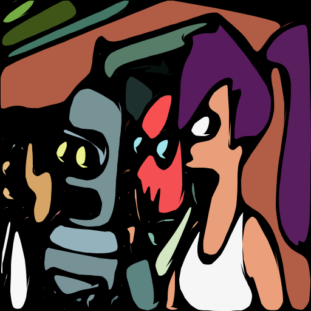

# Cartoon Upsample

I set out to develop a system that upscales frames from cartoon videos. Bilinear interpolation works well for most content, but in cartoons it blurs well defined shapes. Many cartoons today are rendered from vector components. If we had the vector components that rendered our source frame we could simply rerender the image at a higher resolution. This project attempts to determine the original components that rendered the frame to produce high quality renders at larger resolutions.

To illustrating the system I'm going to walk through the process with a frame from Futurama.


## Quadtree (src/quadtree.rs)

The first thing I decided to do is split the image into a quad tree. I recursively split the image into 4 when the segment's variance was above a specified threshold. 

To calculate the difference between pixels I took into account color perception. I used an implementation I found at [compuphase.com](http://www.compuphase.com/cmetric.htm).

```
160 fn color_diff(a: &Rgb<u8>, b: &Rgb<u8>) -> f64 {
161     // Source: http://www.compuphase.com/cmetric.htm
162     let rmean = (a[0] as i64 + b[0] as i64) / 2;
163     let r = a[0] as i64 - b[0] as i64;
164     let g = a[1] as i64 - b[1] as i64;
165     let b = a[2] as i64 - b[2] as i64;
166     return f64::sqrt(((((512 + rmean) * r * r) >> 8) + 4 * g * g + (((767 - rmean) * b * b) >> 8)) as f64);
167 }
```

Through experimentation I modified my variance calculation to raise the residual error to the third power.

```
80     for y in yi..yf {
81         for x in xi..xf {
82             let pixel = img.get_pixel(x, y);
83             var += color_diff(&avg, pixel).powf(3.0);
84         }
85     }
86 
87     var /= items;
```

Here is a debug render where the outline of each leaf is rendered in black over of the original image.



Here is a debug render where each leaf of the quadtree is rendered as a solid color.




## Shape Extractor (src/shape.rs)

Now that I have a quadtree that describes the image, I want to construct an arrays of shapes. Here I define a shape as basically just an array of connected quadtree leafs.

```
 8 pub struct Shape {
 9     pub color: Rgb<u8>,
10     pub parts: Vec<Box<QuadTree>>,
11     pub area: f64,
12 } 
```

The algorithm for shape extraction works by first finding at a leaf in the quadtree. The leaf is then removed from the quadtree and the four edges around the leaf's region are pushed onto a stack called `edges`.

```
113 fn add_edges(tree: &Box<QuadTree>, edges: &mut Vec<(Edge, Rgb<u8>)>) {
114     let r = tree.region;
115     let tl = Point{x:r.x, y:r.y};
116     let tr = Point{x:r.x+r.width, y:r.y};
117     let bl = Point{x:r.x, y:r.y+r.height};
118     let br = Point{x:r.x+r.width, y:r.y+r.height};
119     
120     edges.push(((tl, tr), tree.color));
121     edges.push(((tr, br), tree.color));
122     edges.push(((br, bl), tree.color));
123     edges.push(((bl, tl), tree.color));
124 }
```

While edges is not empty we pop off an edge and recusrively search the quadtree for a collision between the edges and a leaf.

```
151         // Vertical edge
152         if edge.0.x == edge.1.x {
153             // Made sure at least one side aligns with our edge
154             if tree.region.x != edge.0.x && tree.region.x + tree.region.width != edge.0.x {
155                 return None;
156             }
157             if (tree.region.y > edge.0.y || tree.region.y + tree.region.height < edge.0.y) &&
158                     (tree.region.y > edge.1.y || tree.region.y + tree.region.height < edge.1.y) {
159                 return None;
160             }
161         }   
162         // Horizontal Edge
163         else {  
164             if tree.region.y != edge.0.y && tree.region.y + tree.region.width != edge.0.y {
165                 return None;
166             }
167             if (tree.region.x > edge.0.x || tree.region.x + tree.region.height < edge.0.x) &&
168                     (tree.region.x > edge.1.x || tree.region.x + tree.region.height < edge.1.x) {
169                 return None;
170             }
171         } 
```

If a collision with a leaf is found it means that the leaf borders a component in our shape. If this bordering leaf meets the conditions of the shape, it is removed from the quadtree, added to the shape, and the edges of the leaf's region are pushed on the edges stack. This algorithm grows the shape by searching for neighboring leafs in the quadtree. An important part of this algorithm is that it removes the leaf from the quadtree when it is placed into a shape. This prevents a leaf from being a part of two shapes.

I tried a lots of metric to determine whether a leaf should be considered part of a shape. The best metric I came up with used the difference between the shape's average color and the new leaf's color, and the shape's neighboring leaf's color and the new leaf's color.

```
color_diff(cc, option.color) < 80.0 || color_diff(src_color, option.color) < 5.0; 
```

The best results I could derive from this were disapointing. This is a debug render where each shape is given a random color.



The image has a lot of noise and some errors. Notice how the hair in the back left bleeds into the the background wall. After trying this problem with many different tactics I came up with a clever idea while looking at the debug render of the quadtree.


In the debug render the outline of the shapes are rendered with thick black lines. These black lines are the borders of the quadtree's leafs. They form a thick black line because the variance in the outline regions is so high the quadtree has split till the leafs are the size of a single pixel. The idea is to use the algorithm above to construct a shape that grows based on the neighbor's leaf size rather than color.

In the first step we collect all the shapes where the area of the leaf is 1 pixel. Here is a debug render of these shapes where each shape is given a random color.


After the oulines have been removed from the quadtree I run the shape extraction algorithm that grows based on color. The shapes in the second extraction are shown in the following debug render.



As you can see, each shape is extracted with little error. There is however an issue. The gap between shapes is too large, we'll address this issue later.

## Perimeter (src/perimeter.rs)

Now we have an array of shapes which are descibed as an array of leafs. From the leafs of a shape we want to build an array of points that describe a path around the polygon shape. This was a fun algorithm to develop. After a few different ideas on paper and code I came up with the following.

First I rasterize the shape to its own frame buffer with a padding of one pixel. I then scan the rows of the frame buffer till I find a filled pixel. The algorithm starts with the cursor at the position the first filled pixel was found.

I then do the following until the cursor is moved to the first cursor's position.

I populate an array called circle with the 8 pixels that neighbor the cursor.

```
13 const CIRCLE_X:[i64; 8] = [-1, 0, 1, 1, 1, 0, -1, -1];
14 const CIRCLE_Y:[i64; 8] = [-1, -1, -1, 0, 1, 1, 1, 0];

59         for i in 0..8 {
60             circle[i] = image.data[((cx + CIRCLE_X[i]) + (cy + CIRCLE_Y[i]) * w) as usize];
61         }  
```

The indexes for the circle are mapped as

```
0 | 1 | 2
7 | X | 3
6 | 5 | 4
```

Then starting at an index on the circle I know is outside the of the polygon, I scan clockwise through the circle until I hit a shadded pixel. This shadded pixel becomes the new cursor position. By moving around the polygon I can always know the point on the next cursor's circle that is outside of the polygon. The index on the circle is looked up in `CIRCLE_B` with the circle index where the shadded pixel was found.

```
15 const CIRCLE_B:[i64; 8] = [7, 7, 1, 1, 3, 3, 5, 5];
```

We know that circle index `7` is outside of the polygon for the first pixel because we found it by searching from left to right where the image had a one pixel padding. This algorithm goes around the perimeter of the shape in a binary image in a clockwise fashion and collects all the points along the way.


## Path Processing (src/path\_processing.rs)

We now have the a perimeter that describes each of our shapes. Here is a render drawing each polygon with the shape's average color.



This looks pretty good. With a little processing we can smooth out the shape's edges and be on our way.

The first thing I do is apply a weighted average to the points on the path using the following kernel.

```
//                                     current point
//                                          \|/
5     let kernel = [0.15, 0.25, 0.55, 0.75, 1.0, 0.7, 0.5, 0.2, 0.1];
```

The second thing I do is simplify the points along the path using the Ramer-Douglas-Peucker algorithm. Here is a render after processing the path.


It looks better but there are still a few rough edges. Before addressing the outline width here is my final image. For this render I made every third point on the path a control point for a bezier curve.




## Addressing outline width

I started work on a few different techniques, however they did not pan out in time for the project's due date. I addressed this issue with an inefficient patch where I upscale the image to 2048x2048 using a Cubic Filter before processing. By doing this the outline regions are relatively smaller. Here is the final render when doing this preprocessing.



## Other

By tunning the parameters you can get some cool effects


