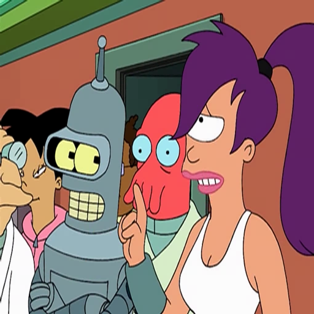
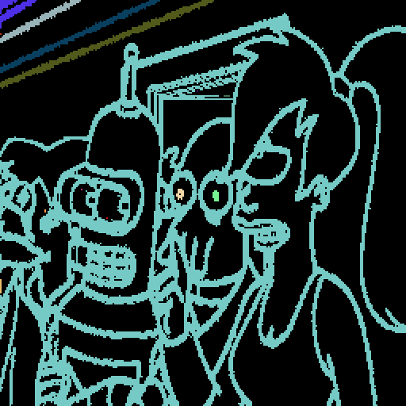

# Cartoon Upsample

I set out to develop a system that upscales frames from cartoon videos. Bilinear interpolation works well for most content but in cartoons it blurs well defined shapes. Many cartoons today are rendered from vector components. If we had the vector components that rendered our source frame we could simply rerender the image at a higher resolution. This project attempts to determine the original components that rendered the frame to produce high quality renders at larger resolutions.

Illustrating the system I came up with I'll walk through the process with the following image.


## Quadtree (src/quadtree.rs)

The first thing I decided to do is split the image into a quad tree. I recursively split the image into 4 when the segment's variance was above a specified threshold. 

To calculate the difference between pixels I took into account color perception. I used an implementation I found at [compuphase.com](http://www.compuphase.com/cmetric.htm).

```
160 fn color_diff(a: &Rgb<u8>, b: &Rgb<u8>) -> f64 {
161     // Source: http://www.compuphase.com/cmetric.htm
162     let rmean = (a[0] as i64 + b[0] as i64) / 2;
163     let r = a[0] as i64 - b[0] as i64;
164     let g = a[1] as i64 - b[1] as i64;
165     let b = a[2] as i64 - b[2] as i64;
166     return f64::sqrt(((((512 + rmean) * r * r) >> 8) + 4 * g * g + (((767 - rmean) * b * b) >> 8)) as f64);
167 }
```

Through experimentation I modified my variance calculation to raise the risidual error to the third power.

```
 80     for y in yi..yf {
 81         for x in xi..xf {
 82             let pixel = img.get_pixel(x, y);
 83             var += color_diff(&avg, pixel).powf(3.0);
 84         }
 85     }
 86 
 87     var /= items;
```

Here is a debug render where the outline of each leaf is rendered in black over of the original image.


Here is a debug render where each leaf of the quadtree is rendered as a solid color.




## Shape Extractor (src/shape.rs)

Now that I have a quadtree that describes the image, I want to construct an arrays of shapes. Here I define a shape as basically just an array of connected quadtree leafs.

```
  8 pub struct Shape {
  9     pub color: Rgb<u8>,
 10     pub parts: Vec<Box<QuadTree>>,
 11     pub area: f64,
 12 } 
```

The algorithm for shape extraction works by first finding at a leaf in the quadtree. The leaf is then removed from the quadtree and the four edges around the leaf's region are pushed onto a stack called `edges`.

```
113 fn add_edges(tree: &Box<QuadTree>, edges: &mut Vec<(Edge, Rgb<u8>)>) {
114     let r = tree.region;
115     let tl = Point{x:r.x, y:r.y};
116     let tr = Point{x:r.x+r.width, y:r.y};
117     let bl = Point{x:r.x, y:r.y+r.height};
118     let br = Point{x:r.x+r.width, y:r.y+r.height};
119     
120     edges.push(((tl, tr), tree.color));
121     edges.push(((tr, br), tree.color));
122     edges.push(((br, bl), tree.color));
123     edges.push(((bl, tl), tree.color));
124 }
```

While edges is not empty we pop off an edge and recusrively search the quadtree for a collision between a leaf and the edge.

```
151         // Vertical edge
152         if edge.0.x == edge.1.x {
153             // Made sure at least one side aligns with our edge
154             if tree.region.x != edge.0.x && tree.region.x + tree.region.width != edge.0.x {
155                 return None;
156             }
157             if (tree.region.y > edge.0.y || tree.region.y + tree.region.height < edge.0.y) &&
158                     (tree.region.y > edge.1.y || tree.region.y + tree.region.height < edge.1.y) {
159                 return None;
160             }
161         }   
162         // Horizontal Edge
163         else {  
164             if tree.region.y != edge.0.y && tree.region.y + tree.region.width != edge.0.y {
165                 return None;
166             }
167             if (tree.region.x > edge.0.x || tree.region.x + tree.region.height < edge.0.x) &&
168                     (tree.region.x > edge.1.x || tree.region.x + tree.region.height < edge.1.x) {
169                 return None;
170             }
171         } 
```

If a collision with a leaf is found it means that the leaf borders a component in our shape. If this bordering leaf meets the conditions of the shape, it is removed from the quadtree, added to the shape, and the edges of the leaf's region are pushed on the edges stack. This algorithm grows the shape by searching for neighboring leafs in the quadtree. An important part of this algorithm is that it removes the leaf from the quadtree when it is placed into a shape. This prevents a leaf from being a part of two leafs.

I tried a lots of metric to determine whether a leaf should be considered part of a shape. The best metric I came up with used the color difference between the new leaf and the neighboring leaf, and the new leaf and the shape's average color.

```
86             return color_diff(cc, option.color) < 80.0 || color_diff(src_color, option.color) < 5.0; 
```

The best result I could derive from this is disapointing. In this debug render each shape is given a random color.


The image has a lot of noise and some errors. Notice how the hair in the left bleeds into the the background wall. After trying this problem with many different tactics I came up with a clever idea while looking at the debug render of the quadtree.


In the debug render the outline of the shapes are rendered with thick black lines. These black lines are the borders of the quadtree's leafs. They form a thick black line because the variance in the outline regions is so high the quadtree has split till the leafs are the size of a single pixel. The idea is to use the algorithm above to construct a shape that grows based on the neighbor's leaf size rather than color.

In the first step we collect all the shapes where the area of the leaf is 1 pixel. Here is a debug render where each shape is given a random color.


